# AWS Customer Data Platform using Medallion Architecture

> An end-to-end AWS Data Engineering project that implements a Medallion Architecture (Bronze, Silver, Gold) with AWS Glue, PySpark, Step Functions, EventBridge, Athena, and Slowly Changing Dimension (SCD Type 2) for historical data management.

---

## Table of Contents

- [Project Overview](#project-overview)
- [Business Problem](#business-problem)
- [Solution Overview](#solution-overview)
- [Architecture](#architecture)
- [AWS Services Used](#aws-services-used)
- [Repository Structure](#repository-structure)
- [Data Pipeline Workflow](#data-pipeline-workflow)
- [Bronze Layer](#bronze-layer)
- [Silver Layer](#silver-layer)
- [Gold Layer](#gold-layer)
- [SCD Type 2 Implementation](#scd-type-2-implementation)
- [Workflow Orchestration](#workflow-orchestration)
- [Monitoring and Notifications](#monitoring-and-notifications)
- [ETL Tracker](#etl-tracker)
- [Data Quality Checks](#data-quality-checks)
- [Project Screenshots](#project-screenshots)
- [Key Skills Demonstrated](#key-skills-demonstrated)
- [Future Enhancements](#future-enhancements)

---

# Project Overview

This project demonstrates the design and implementation of a cloud-native Customer Data Platform (CDP) on AWS using a Medallion Architecture. The solution ingests raw customer data from Amazon S3, transforms and enriches it using AWS Glue and PySpark, and builds a historical customer dimension using Slowly Changing Dimension (SCD Type 2).

The pipeline is fully orchestrated using AWS Step Functions, automatically scheduled with Amazon EventBridge, monitored through CloudWatch Logs, and integrated with Amazon SNS for operational notifications.

The final curated data is stored in Parquet format and made available for analytics through Amazon Athena.

---

# Business Problem

Many organizations receive customer data from multiple operational systems. Raw data often contains:

- Duplicate customer records
- Missing or inconsistent values
- Country codes instead of readable country names
- Customer updates that overwrite historical information

Without a structured data engineering pipeline, reporting becomes unreliable and customer history cannot be accurately tracked.

This project addresses these challenges by implementing a scalable Medallion Architecture with historical data management using SCD Type 2.

---

# Solution Overview

The pipeline follows a three-layer Medallion Architecture:

```text
Landing (CSV Files)
        │
        ▼
Bronze Layer
Raw data converted to Parquet
        │
        ▼
Silver Layer
Cleaned, validated and enriched data
        │
        ▼
Gold Layer
Customer Dimension (SCD Type 2)
        │
        ▼
Amazon Athena
```

The workflow is automatically orchestrated and monitored using AWS managed services.

---

# Architecture


---

# AWS Services Used

| Service | Purpose |
|----------|---------|
| Amazon S3 | Stores landing, Bronze, Silver and Gold data |
| AWS Glue ETL | Executes PySpark ETL jobs |
| AWS Glue Crawlers | Creates Data Catalog metadata |
| AWS Glue Data Catalog | Metadata repository for Athena |
| Amazon Athena | SQL analytics on Parquet datasets |
| AWS Step Functions | Orchestrates the ETL workflow |
| Amazon EventBridge | Schedules daily pipeline execution |
| Amazon SNS | Sends success and failure notifications |
| Amazon CloudWatch | Job logging and execution monitoring |

---

# Repository Structure

```text
aws-customer-data-platform-medallion-architecture/
│
├── architecture/
│   └── architecture.png
│
├── documentation/
│
├── glue-jobs/
│   ├── bronze_load_job.py
│   ├── silver_enrichment_job.py
│   └── gold_scd2_job.py
│
├── sample-data/
│   ├── customer_day1.csv
│   ├── customer_day2.csv
│   ├── customer_day3.csv
│   └── country_lookup.csv
│
├── screenshots/
│
└── README.md
```
---

# Data Pipeline Workflow

The Customer Data Platform follows a Medallion Architecture to progressively improve data quality across three layers.

```text
Customer CSV Files
        │
        ▼
Amazon S3 Landing Layer
        │
        ▼
Bronze ETL (AWS Glue)
        │
        ▼
Bronze Layer (Parquet)
        │
        ▼
Silver ETL (AWS Glue)
        │
        ▼
Silver Layer (Cleaned & Enriched)
        │
        ▼
Gold ETL (SCD Type 2)
        │
        ▼
Gold Customer Dimension
        │
        ▼
Amazon Athena
```

Each layer has a specific responsibility, making the pipeline scalable, maintainable, and suitable for analytics.

---

# Bronze Layer

The Bronze layer is responsible for ingesting raw customer and country lookup data from Amazon S3.

### Responsibilities

- Read raw CSV files from the Landing layer
- Convert CSV files into Parquet format
- Preserve source data with minimal transformation
- Add an ingestion timestamp (`load_date`)
- Store data in the Bronze layer for downstream processing

### Technologies Used

- AWS Glue
- PySpark
- Amazon S3
- Parquet

---

# Silver Layer

The Silver layer improves data quality by cleaning, validating, deduplicating, and enriching customer records.

### Transformations Performed

- Trim whitespace
- Standardize country codes
- Convert timestamps
- Remove duplicate customer records
- Keep the latest customer record using Window functions
- Join customer data with country lookup information
- Add processing timestamp

### Technologies Used

- AWS Glue
- PySpark
- Window Functions
- Join Operations

---

# Gold Layer

The Gold layer builds the analytical Customer Dimension using Slowly Changing Dimension (SCD Type 2).

Instead of overwriting customer information, the pipeline preserves historical versions whenever tracked customer attributes change.

### Gold Layer Responsibilities

- Detect new customers
- Detect changed customer records
- Preserve historical records
- Generate surrogate keys
- Maintain current and historical versions
- Update ETL Tracker
- Perform data quality validation

The Gold layer provides a complete historical view of customer information for reporting and analytics.

---

# SCD Type 2 Implementation

The Gold layer implements Slowly Changing Dimension (SCD Type 2) using hash-based change detection.

### Features

- Surrogate Key (`customer_sk`)
- Business Key (`cust_id`)
- Current Flag (`current_flag`)
- Valid From (`valid_from`)
- Valid To (`valid_to`)
- Hash comparison for change detection

When a customer record changes:

1. The existing record is marked as historical (`current_flag = 'N'`).
2. The `valid_to` timestamp is updated.
3. A new version of the customer record is inserted with a new surrogate key.
4. The new record becomes the current version (`current_flag = 'Y'`).

This approach preserves a complete history of customer changes while ensuring only one active version exists for each customer.

---

# Hash-Based Change Detection

To efficiently detect updates, the pipeline generates SHA-256 hashes using tracked customer attributes.

The hash includes fields such as:

- First Name
- Last Name
- Email
- Phone
- Address
- City
- State
- Postal Code
- Country
- Region

If the incoming hash differs from the existing Gold record, a new historical version is created.

This avoids comparing every individual column and improves the scalability of incremental processing.

---

# Incremental Processing

The Gold pipeline supports incremental processing.

For each execution, customer records are classified into:

- New customers
- Changed customers
- Unchanged customers

Only new and changed records are processed, reducing unnecessary computation and improving performance.

---

# Surrogate Key Generation

Customer Dimension records use surrogate keys instead of business keys.

Each new version of a customer receives a unique `customer_sk`.

The latest surrogate key is maintained in the ETL Tracker to ensure unique key generation across pipeline executions.

---

# Workflow Orchestration

The entire ETL pipeline is orchestrated using **AWS Step Functions**, ensuring that each stage executes in the correct sequence.

## Workflow

```text
Start
   │
   ▼
Bronze ETL
   │
   ▼
Silver ETL
   │
   ▼
Gold ETL
   │
   ▼
SNS Success Notification
   │
   ▼
End
```

The workflow includes built-in **Retry** and **Catch** mechanisms to improve reliability and handle failures gracefully.

### Features

- Sequential ETL execution
- Automatic retries for transient failures
- Failure handling using Catch blocks
- Success and failure notifications through Amazon SNS
- Centralized execution monitoring

---

# Pipeline Scheduling

The pipeline is automatically triggered using **Amazon EventBridge**.

Instead of manually starting the ETL jobs, EventBridge invokes the Step Functions workflow based on a predefined schedule.

### Benefits

- Fully automated execution
- No manual intervention
- Consistent processing schedule
- Supports production-style batch processing

---

# Monitoring and Notifications

Operational monitoring is implemented using AWS managed services.

## Amazon CloudWatch

CloudWatch captures:

- Glue job logs
- Step Functions execution logs
- Runtime information
- Error messages

These logs help troubleshoot pipeline failures and monitor execution.

## Amazon SNS

Amazon SNS is used to notify users about pipeline execution.

### Success Notification

- Sent when the entire workflow completes successfully.

### Failure Notification

- Sent when the workflow encounters an unrecoverable error after retry attempts.

This provides immediate visibility into pipeline status.

---

# ETL Tracker

The Gold layer maintains an ETL Tracker that records metadata about each pipeline execution.

The tracker stores:

| Field | Description |
|-------|-------------|
| table_name | Name of the processed table |
| processed_rows | Number of rows processed |
| last_surrogate_id | Latest surrogate key generated |
| last_source_updated_at | Latest source record timestamp |
| load_date | ETL execution timestamp |

The ETL Tracker supports incremental processing by maintaining the latest processing state.

---

# Data Quality Checks

Before writing data to the Gold layer, several validation checks are performed.

## Validations

- No NULL Customer IDs
- No duplicate surrogate keys
- Only one current record per customer
- Processed row count validation

If any validation fails, the Glue job raises an exception and the pipeline stops to prevent invalid data from being written.

---

# Project Screenshots

## Architecture

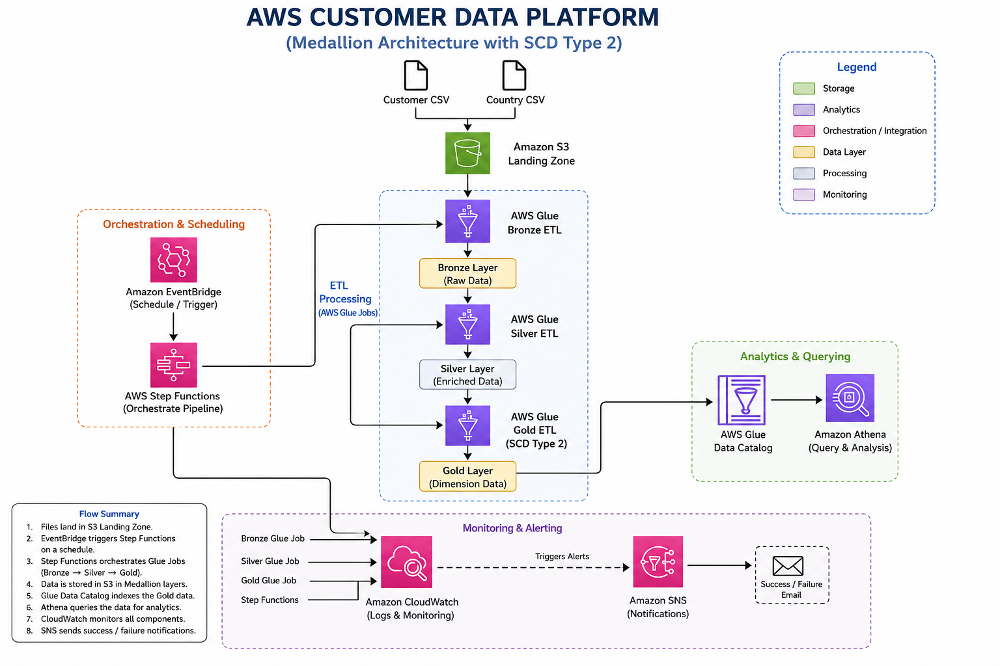

---

## Bronze Layer

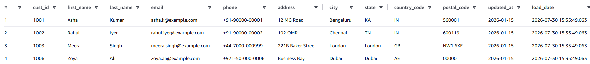

---

## Silver Layer

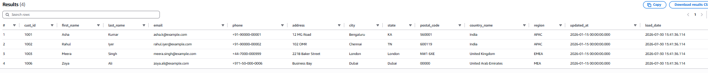

---

## Gold Layer

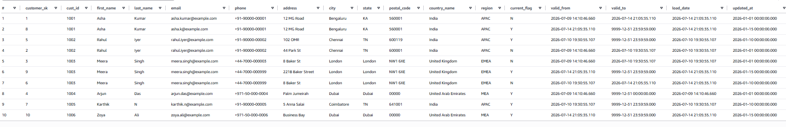

---

## ETL Tracker

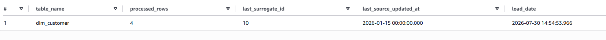

---

## AWS Glue Jobs

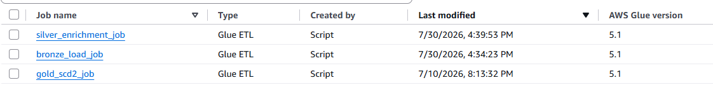

---

## Step Functions - Successful Execution

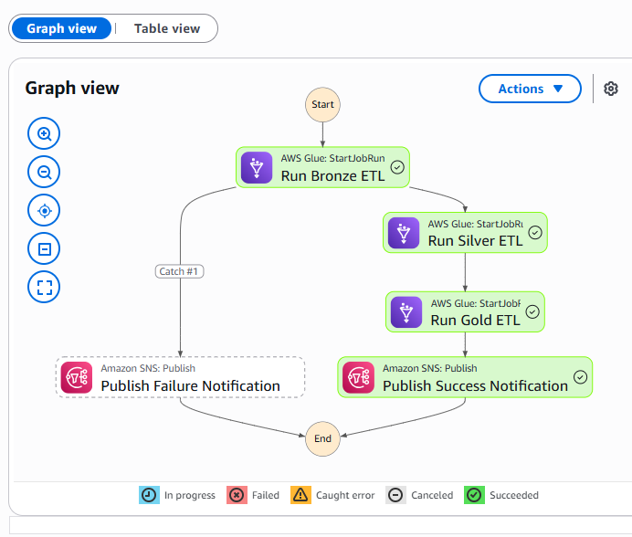

---

## Step Functions - Failure Handling

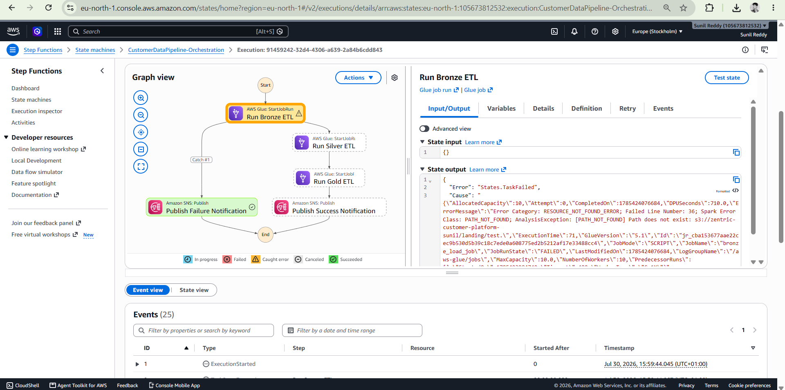

---

## Amazon SNS Notifications

### Success Notification

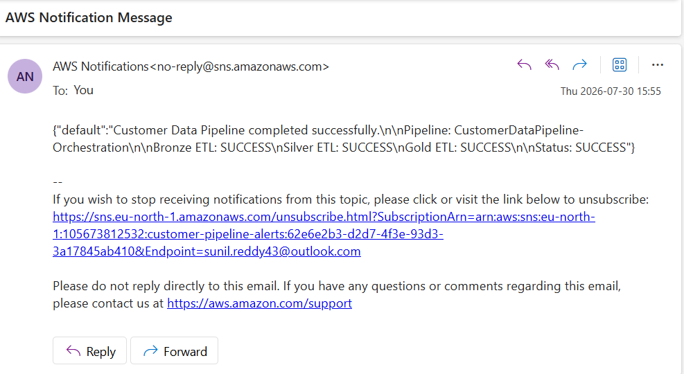

### Failure Notification

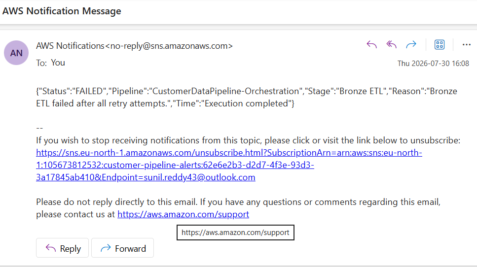

---

## Amazon EventBridge Schedule

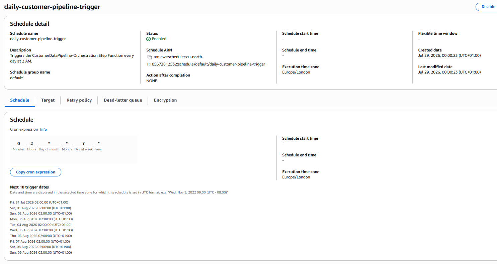

---
# Key Skills Demonstrated

This project demonstrates practical data engineering skills across cloud platforms, ETL development, data modeling, orchestration, and monitoring.

### Cloud & Data Engineering

- Amazon S3
- AWS Glue ETL
- AWS Glue Crawlers
- AWS Glue Data Catalog
- Amazon Athena
- AWS Step Functions
- Amazon EventBridge
- Amazon SNS
- Amazon CloudWatch

### Programming & Data Processing

- Python
- PySpark
- SQL
- Parquet
- Window Functions
- SHA-256 Hash-Based Change Detection

### Data Engineering Concepts

- Medallion Architecture
- ETL Pipeline Development
- Data Cleansing
- Data Enrichment
- Incremental Data Processing
- Slowly Changing Dimension (SCD Type 2)
- Surrogate Key Generation
- Data Quality Validation
- ETL Metadata Tracking

---

# Future Enhancements

Potential improvements for this project include:

- Implement Infrastructure as Code using Terraform
- Build CI/CD pipelines with GitHub Actions
- Integrate AWS Lambda for event-driven processing
- Add Amazon QuickSight dashboards for business reporting
- Implement Great Expectations for advanced data quality validation
- Use AWS Lake Formation for centralized data governance
- Add support for Change Data Capture (CDC)
- Deploy the solution using AWS CloudFormation

---

# Documentation

Additional project documentation is available in the `documentation` folder.

| Document | Description |
|----------|-------------|
| Project_Overview.md | Business problem, objectives and solution overview |
| Architecture.md | Architecture design and AWS services |
| ETL_Workflow.md | Bronze, Silver and Gold workflow explanation |
| SCD_Type2_Implementation.md | Historical tracking and incremental processing |
| Testing_Results.md | Testing approach, validation and monitoring |

---

# Getting Started

To reproduce this project:

1. Create the required Amazon S3 bucket structure.
2. Upload the sample datasets to the Landing layer.
3. Create AWS Glue Crawlers and Data Catalog tables.
4. Deploy the AWS Glue ETL jobs.
5. Configure the AWS Step Functions workflow.
6. Create an Amazon EventBridge rule to schedule the workflow.
7. Configure Amazon SNS for success and failure notifications.
8. Query the Gold layer using Amazon Athena.

---

# Author

**Sunil Reddy**

**Data Engineer**

### Connect with me

- LinkedIn: www.linkedin.com/in/sunil-reddy-35aa203ab
- GitHub: https://github.com/Sunil43-DA

---

# License

This project is provided for learning and portfolio purposes.

You are welcome to explore the code and architecture for educational use.
